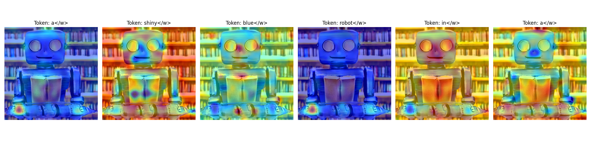

# Stable Diffusion Interpretability Lab

This repository documents my research on **Diffusion Latent Interpretability**. The work explores how attention maps inside Stable Diffusion models can be extracted, visualized, and used for image manipulation.

## 🚀 Research Phases
- **Phase 1:** Basic image generation and global attention heatmaps.
- **Phase 2:** Granular per-token overlay, mapping prompt tokens to image regions.
- **Phase 3 (Upcoming):** Self-attention extraction for structural manipulation and plug-and-play control.

## 🔧 Project Structure
- `test_gen.py` — Stable Diffusion inference script for CPU-based image generation.
- `visualize_attn.py` — Attention heatmap visualization for generated images.
- `visualize_2ndphase.py` — Token-level attention overlay experiments.
- `visualize_3rdphase.py` — Advanced model attention extraction and analysis.
- `pnp_injection_final.py` — Plug-and-play structural manipulation code.
- `pro_token_visualization.png` — Example token visualization output.

## 📦 Setup
1. Clone the repository.
2. Install Python dependencies:
   ```bash
   python -m pip install -r requirements.txt
   ```
3. If there is no `requirements.txt`, install the core packages manually:
   ```bash
   python -m pip install torch diffusers
   ```

## ▶️ Usage
- Generate an image:
  ```bash
  python test_gen.py
  ```
- Visualize attention maps:
  ```bash
  python visualize_attn.py
  ```
- Run token-level overlay experiments:
  ```bash
  python visualize_2ndphase.py
  ```
- Run advanced attention extraction:
  ```bash
  python visualize_3rdphase.py
  ```
- Run PnP injection experiment:
  ```bash
  python pnp_injection_final.py
  ```

## 📊 Visual Evidence


## 📌 Notes
- This repository is focused on exploratory research, not production deployment.
- The scripts are designed to help understand how prompts and attention interact inside Stable Diffusion.
